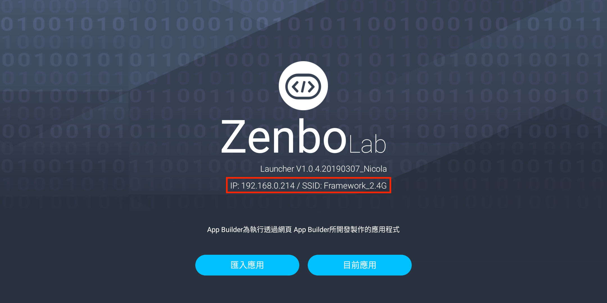
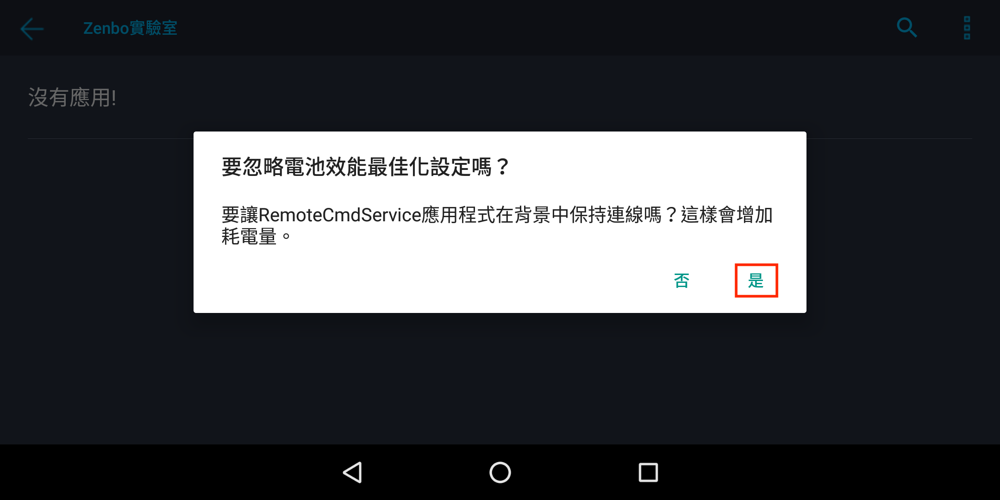

# Python Zenbo junior SDK project #

## Import ##
***pyzenbo 支援 python 3.6 以上版本***

在 pyzenbo 目錄下執行 `python setup.py install` or
`python3 setup.py install` 安裝 pyzenbo 後可直接 import
```Python
import pyzenbo
```
在 pyzenbo 未安裝前，可透過 tests\context.py 在執行時將目前目錄加入 system path，
未來將會提供 pip 安裝或預載。
```Python
from context import pyzenbo
```
## Initial ##
開始使用 Python Zenbo junior SDK 前，需要先開啟 Zenbo junior 上的 Zenbo Lab ，
開啟後會顯示目前連線的 Wi-Fi SSID 及 IP。


第一次啟動時需要同意忽略電池效能最佳化設定。


pyzenbo 需要 Zenbo Lab 上顯示的 IP 並且與 Zenbo junior 在同一區網中。

SDK 使用完畢後，需使用 `sdk.release()` 結束與 Zenbo junior 的連線。
如未正常結束連線， service 將會在 25 秒後斷開連線，等待下一次連線。
```Python
import pyzenbo

host = '192.168.0.214'
sdk = pyzenbo.connect(host)

sdk.motion.move_head(0, 30, 2)

sdk.release()
```

## Usage ##
pyzenbo 指令參數與 android 版 Zenbo SDK 相同，相關參數請參閱 Zenbo SDK 文件。

pyzenbo 可使用 callback 形式取得指令執行的結果
```Python
from pyzenbo.modules.error_code import code_to_description


def on_state_change(serial, cmd, error, state):
    msg = 'on_state_change serial:{}, cmd:{}, error:{}, state:{}'
    print(msg.format(serial, cmd, error, state))
    if error:
        print('on_state_change error:', code_to_description(error))


def on_result(**kwargs):
    print('on_result', kwargs)


sdk.on_state_change_callback = on_state_change
sdk.on_result_callback = on_result

result = sdk.motion.move_body(10, 0, 0, 2, sync=True, timeout=10)
```

同時也可使用 method 內參數 sync=True 來同步執行，當指令執行完畢後回傳結果或 timeout
後取消目前指令後回傳結果。回傳結果為 tuple，第一項為指令執行的 serial number，
第二個為 dict 包含執行結果 ‘state' 及 'error'。
```Python
STATE = {0: 'INITIAL', 1: 'PENDING', 2: 'REJECTED',
         3: 'ACTIVE', 4: 'FAILED', 5: 'SUCCEED', 6: 'PREEMPTED', }
```

Utility 中`sdk.utility.track_face(sync=False, timeout=None),
sdk.utility.follow_face(sync=False, timeout=None),
sdk.utility.follow_object(sync=False, timeout=None)`
三個指令因為不會主動停止，因此預設 sync=False，建議使用 callback 或使用 timeout
來結束指令。
